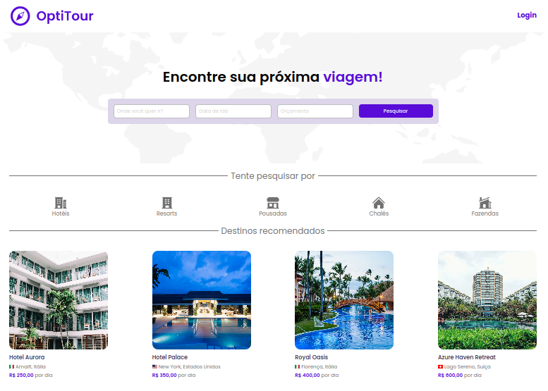
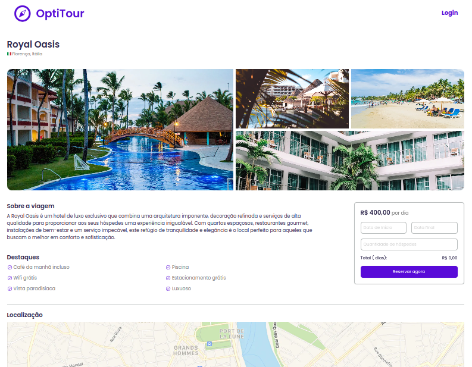
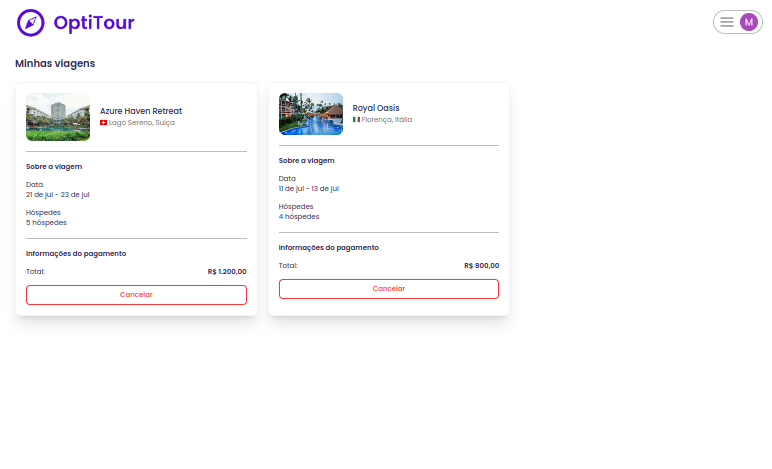

<!-- CABEÇALHO -->

    <h1>
        
    </h1>
    

        <a href="#%EF%B8%8F-sobre-o-projeto">Sobre o Projeto</a> •
        <a href="#-funcionalidades">Funcionalidades</a> •
        <a href="#-layout">Layout</a> •
        <a href="#%EF%B8%8F-tecnologias">Tecnologias</a> •
        <a href="#-autor">Autor</a>
    

<!-- SOBRE O PROJETO -->

## 🖥️ Sobre o Projeto

    
     
     
    

 

> Projeto desenvolvido durante o evento [Full Stack Week](https://fullstackclub.com.br/fsw/) (07/23)

Optitour é uma plataforma de reserva de viagens. ✈️

Com ele é possível pesquisar viagens, ver as informações detalhadas de cada uma delas e fazer uma reserva da viagem desejada.

O projeto foi desenvolvido utilizando TypeScript, Next.js, React, Tailwind CSS, Prisma, banco de dados PostgreSQL, entre outras tecnologias.

Além disso, a aplicação conta com autenticação através de conta do Google e integração de pagamentos via Stripe.

<!-- FUNCIONALIDADES -->

## 💡 Funcionalidades

- [x] Tela Home
  - [x] Login com Google
  - [x] Pesquisa de viagens
  - [x] Pesquisa rápida de viagens por categoria
  - [x] Lista de viagens recomendadas
- [x] Tela "Resultado de Pesquisa"
  - [x] Lista de viagens encontradas na pesquisa
- [x] Tela de Detalhes da Viagem
  - [x] Imagens e informações completas da viagem
  - [x] Reserva de viagem
- [x] Tela de Confirmação da Viagem
  - [x] Checagem de informações da viagem desejada
  - [x] Pagamento da compra da viagem via Stripe
- [x] Tela "Minhas Viagens"
  - [x] Lista de viagens compradas pelo usuário
  - [x] Cancelamento da viagem

<!-- LAYOUT -->

## 🎨 Layout

A aplicação foi baseada no seguinte layout: ?type=design&node-id=194-1733&mode=design&t=1HD2evpOPpSd9HE1-0>)

  

  

<!-- TECNOLOGIAS -->

## 🛠️ Tecnologias

Para o desenvolvimento desse projeto, as seguintes ferramentas foram utilizadas:

- **[React.js](https://pt-br.reactjs.org/)**
- **[Next.js](https://nextjs.org/)**
- **[TypeScript](https://www.typescriptlang.org/)**
- **[Tailwind CSS](https://tailwindcss.com/)**
- **[Prisma](https://www.prisma.io/)**
- **[Supabase](https://supabase.com/)**
- **[Next Auth](https://next-auth.js.org/)**
- **[Stripe](https://stripe.com/br)**
- **[React Hook Form](https://www.react-hook-form.com/)**
- **[Zod](https://zod.dev/)**
- **[Radix UI](https://www.radix-ui.com/)**
- **[React Datepicker](https://www.npmjs.com/package/react-datepicker)**
- **[React Currency Input Field](https://www.npmjs.com/package/react-currency-input-field)**

## 👨‍💻 Autor

Marcos Kenji Kuribayashi

 

---

Desenvolvido por Marcos Kenji Kuribayashi 😉
